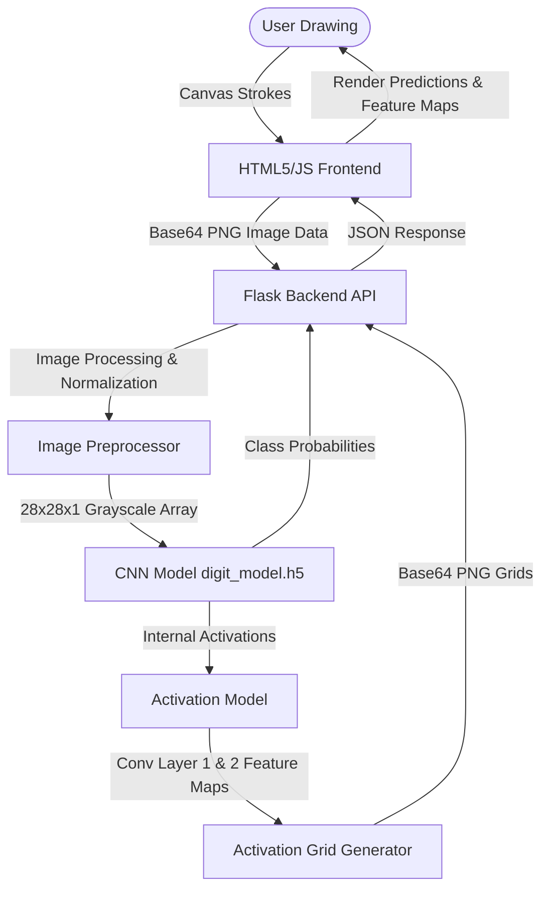

# 🔢 Digit Recognition Studio — Interactive Deep Learning

[](https://huggingface.co/spaces/yogesh3i/digit-classification-studio)

An interactive, glassmorphic handwritten digit recognition platform powered by a Convolutional Neural Network (CNN) trained in TensorFlow/Keras. The project features a stunning web dashboard allowing users to draw digits and explore the model's internal feature representations (what the CNN "sees") in real-time.

---

## 🌟 Features

*   **Interactive HTML5 Drawing Canvas**: High-fidelity canvas with mouse and touch drawing support, dynamic brush sizes, and real-time canvas resizing.
*   **Debounced Auto-Predict**: Generates predictions automatically `350ms` after completing a drawing stroke, offering a seamless user experience.
*   **Real-time CNN Layer Activation Explorer**: Extracts and renders feature maps from the first two convolutional layers (`conv_layer_1` and `conv_layer_2`) to visualize edge, contour, and shape extraction dynamically.
*   **Advanced Diagnostics Dashboard**: Built-in visual metrics highlighting training progress (loss/accuracy curves) and a comprehensive test dataset confusion matrix.
*   **Automated Training Pipeline**: Seamless startup logic—if `digit_model.h5` is missing, the backend automatically triggers `train.py` to train the CNN and rebuild the diagnostic visualizations before launching.
*   **Dockerized Deployment Ready**: Ready for deployment on cloud providers and Hugging Face Spaces.

---

## 🏗️ Architecture & Dataflow

The studio utilizes a classic client-server model to perform live deep learning inference and feature map extraction:



---

## 🛠️ Tech Stack

*   **Deep Learning Framework**: TensorFlow 2.x, Keras
*   **Scientific Compute**: NumPy, Scikit-Learn (metrics & evaluation)
*   **Data Visualization**: Matplotlib, Seaborn, Pillow (PIL)
*   **Backend Server**: Flask (Python)
*   **Modern Frontend**: HTML5 Canvas, Vanilla CSS (Glassmorphic dark-theme design), Vanilla ES6 JavaScript (Google Fonts: Outfit & Inter, Material Icons)

---

## 📁 Repository Structure

```text
digit_recognition_studio/
├── static/
│   ├── assets/              # Generated training evaluation plots
│   │   ├── confusion_matrix.png
│   │   └── training_curves.png
│   ├── css/
│   │   └── style.css        # Premium glassmorphic styling
│   └── js/
│       └── main.js          # Canvas logic, API client, & visualization rendering
├── templates/
│   └── index.html           # Main dashboard template
├── app.py                   # Flask server with preprocessing & activation extraction
├── train.py                 # CNN training script & diagnostics generator
├── digit_model.h5           # Saved trained TensorFlow Keras model (compiled on-demand)
├── Dockerfile               # Production container definition
├── requirements.txt         # Python package dependencies
└── README.md                # Project documentation
```

---

## 🧠 Model Architecture

The deep learning model is a custom convolutional neural network (CNN) optimized for MNIST:

1.  **Conv2D Layer 1**: 32 filters, $3 \times 3$ kernel, ReLU activation. Processes inputs of shape `(28, 28, 1)`.
2.  **MaxPooling2D Layer 1**: $2 \times 2$ pool size.
3.  **Conv2D Layer 2**: 64 filters, $3 \times 3$ kernel, ReLU activation.
4.  **MaxPooling2D Layer 2**: $2 \times 2$ pool size.
5.  **Dropout**: $25\%$ dropout rate to reduce overfitting.
6.  **Flatten**: Flattens the feature maps to a 1D vector.
7.  **Dense Layer**: 128 units, ReLU activation.
8.  **Dropout**: $50\%$ dropout rate.
9.  **Dense Output Layer**: 10 units, Softmax activation (digit classification probability distribution).

---

## 🚀 Getting Started

### 📋 Prerequisites

Ensure you have Python 3.10+ installed on your machine.

### 🔧 Local Installation

1.  **Clone the Repository**:
    ```bash
    git clone https://github.com/<your-username>/digit_recognition_studio.git
    cd digit_recognition_studio
    ```

2.  **Set Up a Virtual Environment**:
    ```bash
    python -m venv venv
    # On Windows:
    venv\Scripts\activate
    # On macOS/Linux:
    source venv/bin/activate
    ```

3.  **Install Dependencies**:
    ```bash
    pip install -r requirements.txt
    ```

### 🏋️ Training the Model Manually

You can train the model and generate performance diagnostics plots by running:
```bash
python train.py
```
*This will download the MNIST dataset, train the CNN model for 6 epochs, save the weights to `digit_model.h5`, and output performance graphics in `static/assets/`.*

### 🖥️ Running the Web Application

Start the Flask web server:
```bash
python app.py
```
Open your browser and navigate to `http://127.0.0.1:7860/` to draw and visualize predictions in real time.

---

## 🐳 Docker Deployment

The application is pre-configured to run inside a Docker container.

1.  **Build the Docker Image**:
    ```bash
    docker build -t digit-recognition-studio .
    ```

2.  **Run the Container**:
    ```bash
    docker run -p 7860:7860 digit-recognition-studio
    ```

3.  Access the interface at `http://localhost:7860`.

---

## 🤗 Hugging Face Spaces Deployment

This repository includes metadata headers in `README.md` configured for Hugging Face Spaces.

To deploy on Hugging Face:
1. Create a new Space on [Hugging Face](https://huggingface.co/spaces) and select **Docker** as the SDK.
2. Push this repository's files to your Hugging Face Space repository.
3. The Space will automatically build using the `Dockerfile` and serve on port `7860`.

---

## 📝 License

Distributed under the MIT License. See `LICENSE` for more information.
